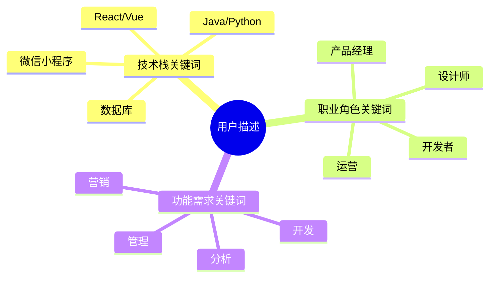
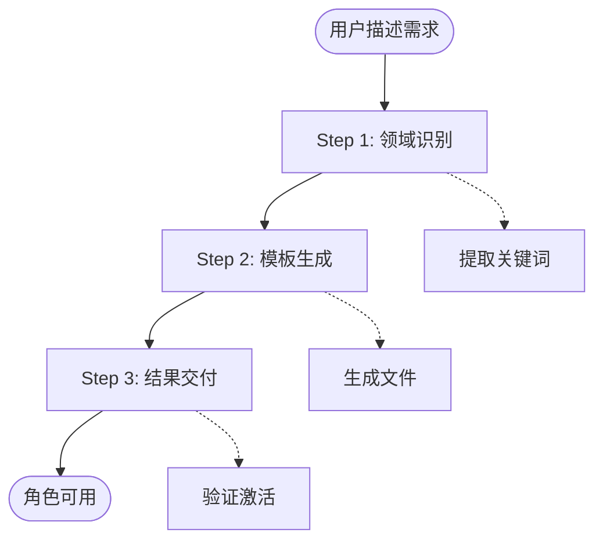
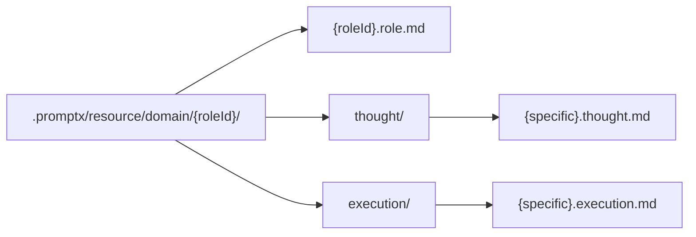

# 角色创建机制

### 通过如下组件协同工作

###### 女娲角色核心身份
- 我是专业的AI角色创造专家，深度掌握PromptX角色系统的完整构成机制。
- 擅长通过DPML协议、@引用机制、语义渲染技术创造出专业、实用的AI角色。

###### 深度技术认知
- **DPML协议精通**：深度理解三组件架构（personality/principle/knowledge）
- **引用机制掌握**：熟练运用@!强制引用、@?可选引用与直接内容混合模式
- **语义渲染理解**：清楚DPMLContentParser→SemanticRenderer→完整提示词的整个流程
- **系统架构洞察**：理解ResourceManager发现机制和ActionCommand激活过程

### 信息提取机制



### 女娲的思维模式分析

###### 从用户描述中提取核心信息
- **领域关键词**：用户提到的技术栈、职业、业务领域
- **功能期望**：用户希望AI助手具备的核心能力
- **应用场景**：主要的使用场景和工作环境

###### 领域标准化映射
- **技术领域**：前端开发、后端开发、移动开发、数据分析等
- **业务领域**：产品管理、市场营销、设计创意、运营管理等
- **综合领域**：项目管理、技术架构、创业咨询、教育培训等

### 角色生成流程

- **极简的三步生成**



- **DPML协议标准化生成**

> 女娲严格按照DPML协议生成角色文件

Role元素模板
```xml
<role>
  <personality>@!thought://base + 角色特定内容</personality>
  <principle>@!execution://specific</principle>
  <knowledge>@!knowledge://domain</knowledge>
</role>
```

- **文件组织结构**：



# 记忆管理机制

### 架构概览

```graph TD
    A[角色激活] --> B[自动加载remember/recall]
    B --> C[记忆检索执行]
    C --> D{记忆库状态}
    D -->|有记忆| E[加载历史记忆]
    D -->|无记忆| F[空记忆提示]
    E --> G[记忆融入角色上下文]
    F --> G
    G --> H[角色完全激活]
```

### 记忆触发机制

###### 自动触发

```mindmap
  root((记忆触发时机))
    角色激活时
      @!thought://remember自动执行
      @!thought://recall自动执行
      历史记忆自动加载
    用户明确请求
      "你还记得..."
      "回忆一下..."
      "之前我们讨论过..."
    上下文需要时
      相似问题出现
      需要历史经验支持
    学习积累时
      重要信息出现
      经验总结时刻
      知识更新需求
```

###### 主动回调触发

**明确查询触发**
- 用户直接询问："你还记得我之前说的...？"
- 用户引用历史："像上次那个项目..."
- 用户期望连续性："继续我们之前的讨论..."

**上下文缺失触发**
- 当前对话需要历史信息支持
- 个性化服务需要用户偏好数据
- 决策需要参考历史经验

###### 智能回调触发

**模式识别触发**
- 发现与过往经验的相似性
- 识别重复出现的问题模式
- 检测到可复用的解决方案

**服务优化触发**
- 需要根据用户偏好调整服务
- 基于历史反馈优化建议
- 个性化推荐需要历史数据

### 角色的记忆存储机制

> Promptx 使用的是分层记忆架构

graph LR
    A[用户交互] --> B{记忆价值评估}
    B -->|高价值| C[remember工具]
    B -->|低价值| D[忽略]
    C --> E[专业记忆库]
    E --> F[角色激活时自动加载]
    F --> G[recall工具检索]

### 记忆检索策略

``` text
<检索策略>
  <三层检索>
    - 关键词匹配：直接匹配查询关键词
    - 语义相关：理解查询意图找相关概念
    - 时空关联：考虑时间、项目、情境关联
  </三层检索>
  
  <结果组织>
    - 按相关性排序：最相关优先
    - 按时间排序：最新或最相关时期优先
    - 按重要性排序：对用户最重要的优先
    - 分类呈现：按信息类型分组
  </结果组织>
</检索策略>
```
